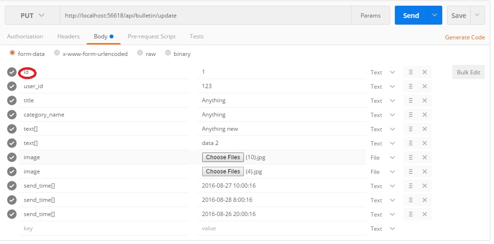

## Publishing the app-

	# Remove the publish directory files before start
	dotnet restore
	dotnet build
	dotnet publish -r ubuntu.14.04-x64

### Before publish-

Run Migration-

	dotnet ef migrations add testMigration
	dotnet ef database update

Detail-

	https://damienbod.com/2015/08/30/asp-net-5-with-sqlite-and-entity-framework-7/

A basic tutorial-

	https://stormpath.com/blog/tutorial-entity-framework-core-in-memory-database-asp-net-core

See the result directory with a platform specific dotnet command able to run the app.

## Server Config-

	https://docs.asp.net/en/latest/publishing/linuxproduction.html

## Error Solution

Remove the `mcp.db` file and run again.

#### Deployment Permission issue-

chmod -R 777 /home/abrar/publish2/

# API Details-

## Insert-

### Url (POST)

	/api/bulletin/insert

### Parameters like this-

## Listing data-

### Url (GET)

	/api/bulletin/get?currentPageNo=1&pageSize=5

Default value (if u hit - `/api/bulletin/get`)

	currentPageNo=1
	pageSize=20

## Update-

### Url (PUT)

	/api/bulletin/insert

### Parameters like this-

